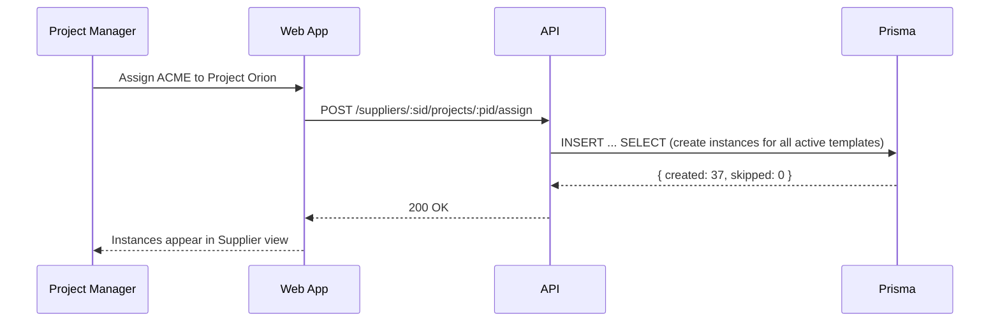

# Supplier Task Management System — Illustrated Use Case (v2, Single‑User Edition)

> Purpose: make the intended workflow crystal-clear with concrete examples, diagrams, and API/UI touchpoints you can implement immediately. This version folds in the new model (task templates & supplier instances), due‑date propagation, and optional milestones/sections.

---

## 1) Primary Use Case (Narrative)

**As a Project Manager (PM)** I define a project (“Project Orion”) and outline the work as **Task Templates**—grouped under Sections (Part Approval, NMR, New Model Builds, General). Some Tasks live under Milestones (e.g., “PPAP Gate 1”), others are section-only.

**As Suppliers are onboarded**, I assign ACME Plastics and Koga Metals to Project Orion. The system **auto‑creates Supplier Task Instances** from the project’s templates. Each instance inherits the canonical due date from the template unless the supplier overrides it.

**As dates shift**, I (PM) move the template due date for “Submit PPAP Docs” from **2025‑09‑15 → 2025‑09‑22**. The system updates all supplier instances **that haven’t set an actual/override date**. ACME had no override → it moves to 9/22. Koga had an agreed extension set at **actualDueDate = 2025‑09‑24** → it **stays 9/24**.

**As execution proceeds**, suppliers flip status (not_started → in_progress → submitted → approved), attach notes/files, and mark blockers. PMs watch dashboards for **Overdue**, **Due next 7 days**, and **Blocked** counts by supplier / section / milestone.

**As scope evolves**, I can add new tasks to the project template (and bulk‑attach them to all assigned suppliers), or deactivate tasks no longer required (set `isApplied=false` on existing instances to preserve history).

---

## 2) Single‑User Scope

This edition is intentionally scoped for **one operator (you)**. No multi‑tenant concerns, no RBAC, no external supplier logins.

- **Sign‑in:** optional single admin passcode (env var) for hosted use; none needed on `localhost`.
- **Data entry:** you create/edit everything (projects, templates, suppliers, instances, statuses, notes, files).
- **Sharing:** distribute **CSV/PDF exports** rather than inviting users.
- **Audit trail:** lightweight change log for your own history (`actor = "admin"`).

---

## 2A) User Workflow — Guaranteed

**✅ 1) Create Suppliers**
- From **Suppliers** view: `New Supplier` → fields: name, contact (optional), code (optional).

**✅ 2) Create Projects & Structured Work via Task Types**
- In **Settings → Task Types**, you can create **Task Types** (e.g., PPAP, NMR, General) and define their **Sections** (e.g., Documentation, Samples) and **Tasks/Sub‑tasks**.
  - **Tasks/Sub‑tasks fields:** `name`, `sequence`, `defaultOwner?`, `defaultNotes?`, **no default due date here** (schedule is set per‑project), `parentTaskId?` for nesting.
  - You can add **Sub‑tasks** under any Task (1‑level nesting is supported in v1).
- When creating a **Project**, pick which **Task Types** it includes. The system generates **Project Task Templates** for all Tasks/Sub‑tasks under those types.
  - At this stage you set the **project’s canonical due dates** (per Task/Sub‑task) once, either as exact dates or relative offsets from an anchor (e.g., Gate 1 +14 days).

**✅ 3) Link Suppliers to a Project & Inherit Tasks**
- When you attach Suppliers to a Project, the system **creates Supplier Task Instances** for *every* Project Task Template.
  - **Due dates**: inherited from the project’s canonical template.
  - **Other fields** (owner, notes, attachments): start **empty**, by design.
- **Propagation** when dates change:
  - **Project-scope change**: editing a canonical due date in the Project updates all Supplier instances **in that project** that have no override (`actualDueDate IS NULL`).
  - **All-projects scope (optional)**: you can also choose to apply the same shift to **every project that uses this Task Type** (see Propagation Scopes below).

---

## 3) End‑to‑End Example (Concrete Data)

### 3.1 Project Template Setup
**Project:** Orion (ID: `proj_orion`)  
**Sections:** Part Approval, NMR, General  
**Milestones:** PPAP Gate 1 (2025‑09‑15), Gate 2 (2025‑10‑06)

**Tasks (subset):
| Task ID | Section | Milestone (opt) | Name | Template Due |
|---|---|---|---|---|
| `task_ppap_docs` | Part Approval | PPAP Gate 1 | Submit PPAP Docs | **2025‑09‑15** |
| `task_run_at_rate` | Part Approval | PPAP Gate 2 | Run at Rate | 2025‑10‑06 |
| `task_dimensional` | Part Approval | (none) | Dimensional Report | 2025‑09‑29 |
| `task_nmr_8d` | NMR | (none) | 8D Report | 2025‑09‑22 |

### 3.2 Assign Suppliers
Assign **ACME Plastics** and **Koga Metals** to Orion → system creates instances:
- ACME: four instances inherit template due dates.
- Koga: same, then Koga negotiates an extension on **PPAP Docs** → sets `actualDueDate=2025‑09‑24`.

### 3.3 Propagation Scenario
On **2025‑08‑28**, PM slips **PPAP Docs** template due date 1 week (→ **2025‑09‑22**).  
- **ACME** instance updates to **9/22** (no override).  
- **Koga** instance remains **9/24** (has override).

> Rule of thumb: **Template changes update only non‑overridden instances** (`actualDueDate IS NULL`).

---

## 4) System Behavior (Truth Table)

| Instance has override? (`actualDueDate`) | Template due changed? | Instance updates its **display due date** to template? |
|---|---|---|
| **No** | Yes | **Yes** (inherit new canonical due date) |
| **Yes** | Yes | **No** (stick to override) |
| **No** | No | No change |
| **Yes** | No | No change |

> Display logic: `effectiveDueDate = actualDueDate ?? dueDate`

---

## 5) Diagrams (from “supplier tracking system.pdf”)

**Figure A — Workflow (PDF):** High‑level swimlane of PM → System → Supplier for: create project, define tasks, assign suppliers, propagate due dates, update statuses, monitor reporting.  
**Figure B — Sequence (textual below):** Template edit → selective propagation → cache invalidation.

### Sequence: Edit Template Due Date
```mermaid
sequenceDiagram
  participant PM as Project Manager
  participant UI as Web App
  participant API as API (Next.js Route)
  participant DB as Prisma
  PM->>UI: Change template due date (PPAP Docs → 2025‑09‑22)
  UI->>API: PUT /project-templates/:id { dueDate, prevUpdatedAt }
  API->>DB: Tx: update template (optimistic lock)
  API->>DB: updateMany SupplierTaskInstance where actualDueDate IS NULL
  DB-->>API: counts { updated: N }
  API-->>UI: 200 OK + counts; invalidate tags (project, dashboard)
  UI-->>PM: Success toast + refreshed list
```

### Sequence: Assign Supplier to Project


---

## 6) Data Model (Prisma)

> Adds **Task Types → Sections → Tasks (with Sub‑tasks)**. Projects pick Task Types, which materialize as **Project Task Templates**. Suppliers get **Instances** copied from templates. Owners/notes can exist on templates (defaults) and instances (actuals). Due dates are **per‑project canonical** with optional global Task Type offsets.

```prisma
model Supplier {
  id        String  @id @default(cuid())
  name      String
  contact   String?
  code      String?
  createdAt DateTime @default(now())
  updatedAt DateTime @updatedAt
}

model Project {
  id        String  @id @default(cuid())
  name      String
  description String?
  createdAt DateTime @default(now())
  updatedAt DateTime @updatedAt
}

model TaskType {                      // User-created in Settings
  id        String  @id @default(cuid())
  name      String  @unique
  createdAt DateTime @default(now())
  updatedAt DateTime @updatedAt
}

model TaskTypeSection {               // Sections belong to a Task Type
  id         String  @id @default(cuid())
  taskTypeId String
  name       String
  sequence   Int

  taskType   TaskType @relation(fields: [taskTypeId], references: [id])

  @@unique([taskTypeId, name])
}

model Task {                          // Tasks & Sub-tasks defined under a Task Type/Section
  id             String  @id @default(cuid())
  taskTypeId     String
  sectionId      String?
  parentTaskId   String?             // for sub-tasks (1 level supported)
  name           String
  description    String?
  sequence       Int
  defaultOwner   String?             // text owner default (single-user)
  defaultNotes   String?

  taskType       TaskType @relation(fields: [taskTypeId], references: [id])
  section        TaskTypeSection? @relation(fields: [sectionId], references: [id])
  parent         Task? @relation("SubTasks", fields: [parentTaskId], references: [id])
  subTasks       Task[] @relation("SubTasks")

  @@unique([taskTypeId, name, parentTaskId])
  @@index([taskTypeId, sectionId])
}

model ProjectTaskType {               // Which Task Types a Project includes
  id         String @id @default(cuid())
  projectId  String
  taskTypeId String
  isActive   Boolean @default(true)

  project    Project  @relation(fields: [projectId], references: [id])
  taskType   TaskType @relation(fields: [taskTypeId], references: [id])

  @@unique([projectId, taskTypeId])
}

model ProjectTaskTemplate {           // Canonical tasks in a Project
  id         String  @id @default(cuid())
  projectId  String
  taskId     String                    // points to Task (or Sub-task)
  sectionId  String?                   // convenience copy for grouping
  dueDate    DateTime                  // canonical per project
  owner      String?                   // default owner at project level
  notes      String?

  // Optional relative scheduling, used to compute dueDate
  anchor     AnchorType @default(PROJECT_START)
  offsetDays Int?

  createdAt  DateTime @default(now())
  updatedAt  DateTime @updatedAt

  project    Project @relation(fields: [projectId], references: [id])
  task       Task    @relation(fields: [taskId], references: [id])

  @@unique([projectId, taskId])
  @@index([projectId, sectionId])
}

enum TaskStatus {
  not_started
  in_progress
  submitted
  approved
  blocked
}

model SupplierProjectInstance {
  id         String  @id @default(cuid())
  supplierId String
  projectId  String
  createdAt  DateTime @default(now())
  updatedAt  DateTime @updatedAt

  supplier   Supplier @relation(fields: [supplierId], references: [id])
  project    Project  @relation(fields: [projectId], references: [id])

  @@unique([supplierId, projectId])
  @@index([supplierId])
  @@index([projectId])
}

model SupplierTaskInstance {          // Concrete per-supplier tasks
  id                        String   @id @default(cuid())
  supplierProjectInstanceId String
  projectTaskTemplateId     String
  status        TaskStatus  @default(not_started)
  dueDate       DateTime                 // inherited copy at creation/sync
  actualDueDate DateTime?                // supplier/project override
  owner         String?                  // actual owner (empty by default)
  notes         String?
  isApplied     Boolean     @default(true)
  blockedReason String?
  submissionFiles Json?

  createdAt DateTime @default(now())
  updatedAt DateTime @updatedAt

  @@index([supplierProjectInstanceId, status])
  @@index([supplierProjectInstanceId, dueDate])
}
```

**Propagation Scopes**
- **Project scope (default):** edits to `ProjectTaskTemplate.dueDate` update `SupplierTaskInstance.dueDate` where `actualDueDate IS NULL` within the same project.
- **All projects using Task Type (optional):** a change made in a Project can be applied to every other `Project` that includes the same `TaskType` **by applying the same delta** (e.g., +7 days) to their `ProjectTaskTemplate` rows, then syncing their Supplier instances.

Indexes you’ll want: `ProjectTaskTemplate(projectId, taskId)`, `SupplierTaskInstance(supplierProjectInstanceId, status)`, `SupplierTaskInstance(supplierProjectInstanceId, dueDate)`.

---

## 7) API Surface (single‑user)

**Suppliers**
- `POST /api/suppliers` `{ name, contact?, code? }`
- `GET /api/suppliers` / `PUT /api/suppliers/:id`

**Task Types & Structure (Settings)**
- `POST /api/task-types` `{ name }`
- `POST /api/task-types/:id/sections` `{ name, sequence }`
- `POST /api/tasks` `{ taskTypeId, sectionId?, parentTaskId?, name, sequence, defaultOwner?, defaultNotes? }`
- `PUT /api/tasks/:id` (edit names/parents/sequence)

**Projects**
- `POST /api/projects` `{ name, description? }`
- `POST /api/projects/:id/task-types` `{ taskTypeId }`  → materialize **ProjectTaskTemplate** rows for every Task/Sub‑task under that type
- `PUT /api/project-templates/:id` `{ dueDate, owner?, notes?, prevUpdatedAt }`  → optimistic lock; propagates to instances lacking overrides
- `POST /api/projects/:id/shift-dates` `{ taskTypeId?, sectionId?, days: +N|-N, scope: "project"|"all-projects-using-type" }` → bulk shift

**Suppliers ⇄ Projects**
- `POST /api/suppliers/:supplierId/projects/:projectId/assign` → creates **SupplierTaskInstance** rows (idempotent)
- `PUT /api/supplier-task-instances/:id` `{ status?, actualDueDate?, owner?, notes?, isApplied?, blockedReason? }`

**Notes**
- Propagation honors overrides: instances with `actualDueDate` do **not** change.
- Global (all‑projects) propagation computes a **delta** from the edit and applies it to same Task across projects using the Task Type.

---

## 8) UI — Flat, ClickUp/Monday/Jira‑inspired (No Tailwind)

> Goals: high‑density, low‑chrome, keyboard‑first. Inline editing everywhere. One primary table + optional board and timeline views. **Styling without Tailwind** using **CSS Modules + design tokens (CSS variables)** and a tiny utilities file.

### Styling approach (Tailwind → CSS Modules)
- **Design tokens** in `src/styles/tokens.css` and global reset.
- **Component styles** in `*.module.css` scoped to each component.
- **Utility classes** (a handful) for layout primitives (e.g., `.stack`, `.cluster`, `.grid`).

### Core Screens
1. **Table (Default)** — spreadsheet‑like grid using **TanStack Table**; columns: Supplier • Task • Section • Milestone • **Effective Due** • Status • Owner • Notes • 📎
   - Inline edit: date, status, owner (free text), notes.
   - Column show/hide, reorder; **saved views** (e.g., *Due Next 7 Days*, *PPAP Only*).
2. **Board** — status columns (Not Started / In Progress / Submitted / Approved / Blocked). Drag to move.
3. **Timeline (Light Gantt)** — rows by Supplier or Section; bars at Effective Due; today line.
4. **Settings → Task Types** — manage Task Types, Sections, Tasks/Sub‑tasks; drag to order; parent/child nesting; preview of resulting Project structure.

### Interaction Model
- **Inline everywhere**; double‑click or `E` to edit, `Esc` cancel.
- **Bulk shift** selected rows ±N days (template or instance level) with **scope switcher**: `This Project` or `All Projects Using This Task Type`.
- **Quick filter** chips: Project, Supplier, Section, Task Type, Status, Overdue.
- **Keyboard**: `/` search, `N` new row, `Cmd/Ctrl+K` command palette, arrows to move, `Enter` save.

### Component stack
- React + Vite, TanStack Table & Query, dnd-kit (board), date-fns, Zustand.
- CSS Modules + tokens; optional Radix for popovers/menus.

---

## 9) Non‑Functional & Ops (Single‑User)

- **Validation:** Zod schemas; consistent problem responses.
- **Concurrency:** optimistic with `updatedAt`.
- **Observability:** minimal—console logs + optional Sentry. No telemetry needed.
- **Testing:** Vitest + Playwright; in‑memory SQLite for unit tests.
- **Deployment:** Vite locally; `docker compose up` for a one‑box server with a mounted SQLite volume.
- **Storage:** **SQLite** primary; migration‑safe via Prisma. Easy export to CSV.
- **Security:** local dev has no auth; for hosted, use a single admin passcode via env checked by API and UI. No RBAC or NextAuth.

---

## 10) Migration Guide (Zero‑drama)

1. Apply Prisma migrations (new models + indices; keep legacy read‑only).
2. Add new routes behind a flag; wire **Suppliers** page to `PUT /supplier-task-instances/:id`.
3. Swap **Dashboard** counts to derived/materialized view on new instances.
4. Turn off legacy writes; snapshot legacy tables; delete later.

---

## 11) Open Questions (to validate intent)

- Confirm the **section vocabulary**: Part Approval, NMR, New Model Builds, General (anything else?).
- Confirm **status machine**: do we need `rejected / resubmitted` or are `notes + blockedReason` enough?
- Do supplier users **upload files** now or link out (SharePoint/Drive)?
- Do we need **notifications** (email/Teams) for due-date changes and overdue? If yes, who gets pinged and how often?

---

### Appendix A — Example Payloads

**Edit template due date**
```json
PUT /api/project-templates/pt_123
{
  "dueDate": "2025-09-22",
  "prevUpdatedAt": "2025-08-18T14:02:10.123Z"
}
```
**Response**
```json
{ "updatedCount": 21 }
```

**Assign supplier to project**
```json
POST /api/suppliers/sup_acme/projects/proj_orion/assign
{}
```
**Response**
```json
{ "created": 37, "skipped": 0 }
```

**Supplier overrides a due date**
```json
PUT /api/supplier-task-instances/sti_789
{ "actualDueDate": "2025-09-24", "notes": "Customer-approved extension" }
```

---

> **Reference**: See “supplier tracking system.pdf” for the swimlane version of the workflow (this document aligns step‑for‑step with that diagram).

